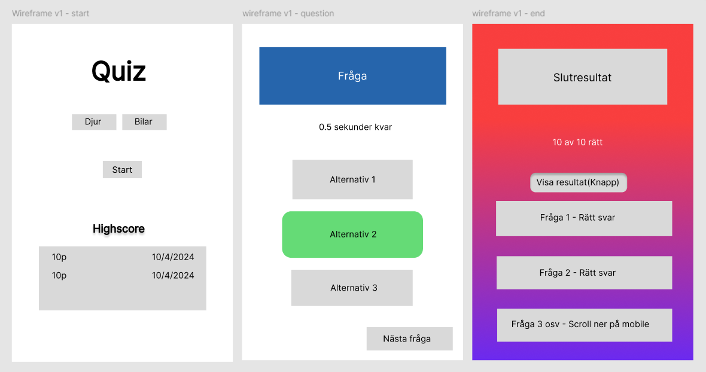

# U03-Techtitans-Quiz

Chas Academy FJS24

Grupp 8: Tech Titans
[johansson-andreas](https://github.com/johansson-andreas)
[Ida Öhlén](https://github.com/idaohlen)
[Martin Södersten](https://github.com/Martinsodersten)
[Therése Perswalld](https://github.com/TheresePerswalld)

## Sammanfattning
Vi har byggt en quiz app där användaren kan välja mellan ett urval av ämnen, och presenteras därefter med ett antal frågor inom den kategorin som denne sedan har 10 sekunder på sig per fråga att svara på. För varje fråga presenteras 3 svarsalternativ där endast ett av dem är korrekt. Väljer användaren rätt svar tilldelas poäng beroende på hur snabbt man har svarat på frågan, och svarar man fel, eller om inget svar väljs, så får man inga poäng på den frågan. I slutet av quizet jämförs summan av poängen med en highscore-lista av 10 tidigare resultat som sparats i webbläsarens local storage, ifall användare har spelat förut. Har man tillräckligt bra poäng läggs det till i highscore-listan (i local storage) och det sämsta resultatet tas bort. När man är färdig kan man även se vilka frågor man har svarat rätt på, och har man inte det så kan man se det korrekta svaret.

## Utvecklingsprocessen
Vi började med att diskutera hur vi ville att appen skulle se ut, och gjorde en enkel skiss i Figma för att se vad vi behövde skapa i HTML för att bygga en prototyp av appen med de viktigaste funktionerna först. Vi gjorde sedan en flowchart för att få en överblick över vilka funktioner som behövdes kodas och hur de hänger ihop med varandra.

Vi gick sedan igenom hur vi skulle planera arbetsprocessen och vilka verktyg vi skulle använda oss av. Vi använde oss av GitHub Projects för att lägga upp issues i en kanban för att hålla reda på vem som gör vad, och vilka delar som är kvar att göra. Efter det kände vi oss redo att börja bygga upp en prototyp av appen med minimal html och CSS och fokuserade på att få alla de grundläggande funktionerna att fungera.

Efter det började vi skissa lite mockups på själva designen i Figma och började styla appen med CSS medan vi finslipade existerande kod och lade till extra funktioner vi ville ha med, såsom en visuell timer som räknas ner och animationer.
När vi skulle koda valde vi att dela upp oss två och två för att jobba tillsammans vid flera tillfällen för att det skulle bli så lärorikt som möjligt för alla och för att ge bättre inblick i vad koden gör, något som man kan gå miste om ifall man delar upp så att alla uppgifter ska genomföras individuellt. Vi har också sett till att regelbundet gå igenom koden vi skrivit i gruppen så att alla kunnat hänga med i vad den gör.

## Prestanda
Förbättringar vi hade kunnat gjort för att öka prestandan:
- Minimerat CSS filerna
- Skapat asynkrona funktioner för att läsa in CSS filerna endast när de behövs
- Applicera event delegatorn på mer specifika html element än hela dokumentet

## Styrkor och brister
### Styrkor:
- Appen fungerar precis som vi vill att den ska göra
- Koden är bra strukturerad och lätt att läsa
- Appen är skalbar och stödjer lätt för ändringar på antal frågor per runda, vilka kategorier vi vill ha med och hur lång tid man får per fråga.

### Brister:
- Göra mer felsökning i olika webbläsare och enheter
- Vi hade kunnat göra mer research om semantiken i HTML och hur vi hade kunnat förbättra den.
- Låt andra testa appen för att kunna hitta eventuella brister och buggar som inte vi själva hittat.
- SEOn hade kunnat bli bättre om vi inte dynamiskt skapade HTML strukturen

## Använda resurser
[canvas-confetti](https://github.com/catdad/canvas-confetti): Visa konfetti när spelet är slut.
